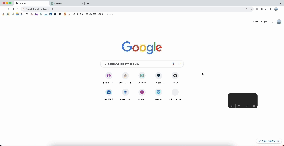

  
  <h1 style="color: hsl(, 100%, 50%);">Block Enter</h1>

Extension to prevent sending by Enter in chat applications. \
[Chrome Web Store link](https://chrome.google.com/webstore/detail/block-enter/epcbggfjoekpdmenggjelljjegjdbpog)

## Target

- [ChatGPT](https://chatgpt.com)
- [Gemini](https://gemini.google.com)
- [Claude](https://claude.ai)
- [Perplexity](https://www.perplexity.ai)

## Usage

Enter： New line \
Ctrl/Cmd + Enter： Send

Toggle on/off by clicking the extension icon.

> [!NOTE]
> In the case of Claude, reloading is required once when toggling.

